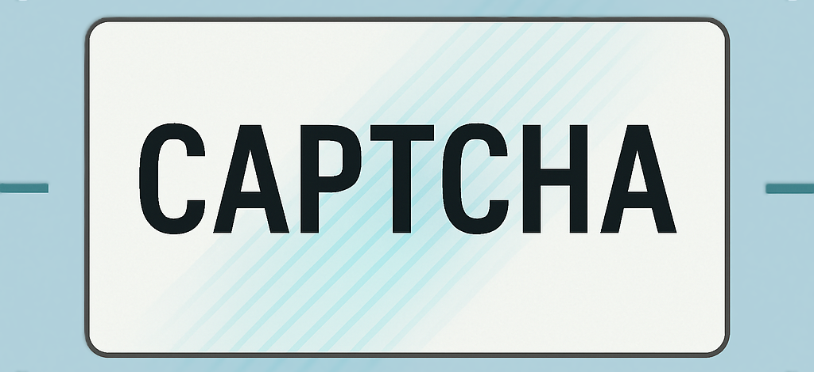

<p align="center">
  
</p>

# CAPTCHA Recognition System 🔐🚀

[](https://github.com/mrro3t/CAPTCHA-Recognition-System/stargazers)
[](LICENSE)
[](https://www.python.org/)


A deep learning-based system to detect and decode CAPTCHA images using a CNN model. A deep learning-based CAPTCHA Recognition system built with convolutional neural networks (CNN).  It automatically detects and decodes CAPTCHA images into readable text with high accuracy.

## 📚 Table of Contents

- [Overview](#-overview)
- [Installation](#-installation)
- [Usage](#-usage)
- [Training](#-training)
- [Evaluation](#-evaluation)
- [Project Structure](#-project-structure)
- [Results](#-results)
- [License](#-license)

## 📌 Overview

This project aims to break CAPTCHA images using a custom-trained neural network model.  
It includes preprocessing, training, prediction, and evaluation modules — designed to be simple and modular.

## 🧪 Installation

Clone the repository and install the dependencies:

```bash
git clone https://github.com/mrro3t/CAPTCHA-Recognition-System.git
cd CAPTCHA-Recognition-System
pip install -r requirements.txt

## 📈 Results

| Metric        | Value      |
|---------------|------------|
| Accuracy      | 96.4%      |
| Loss          | 0.032      |
| Model Size    | 2.1 MB     |
| Inference Time| ~0.05 sec  |

