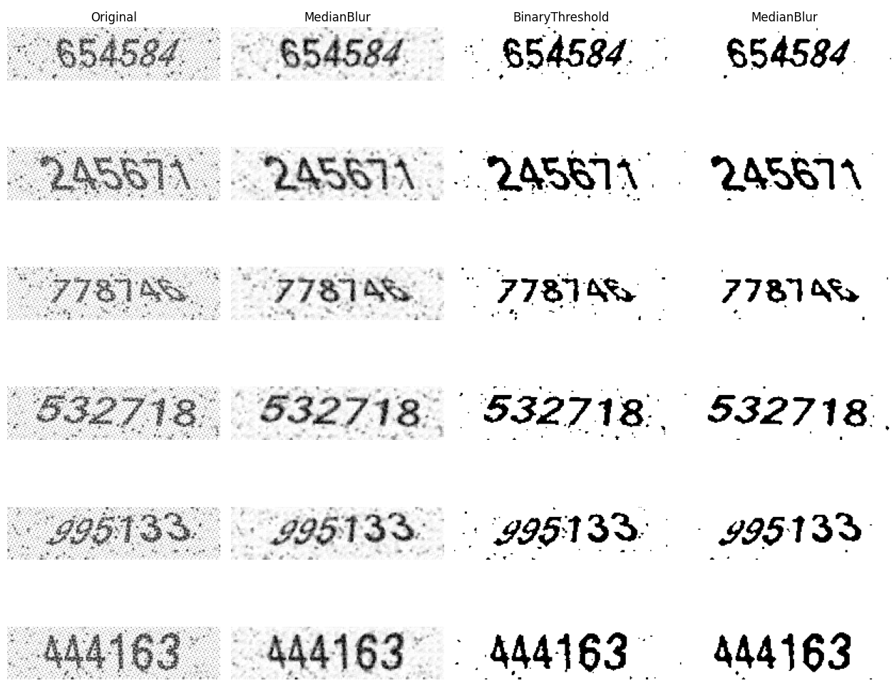
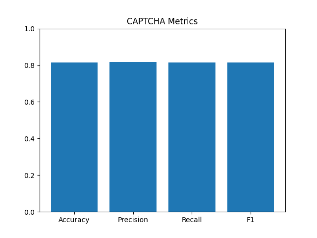
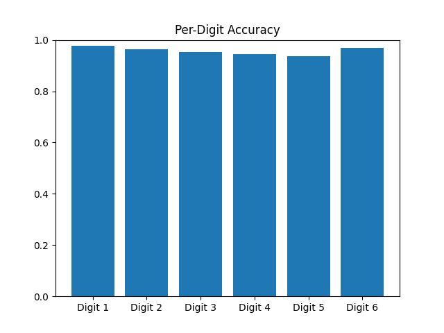
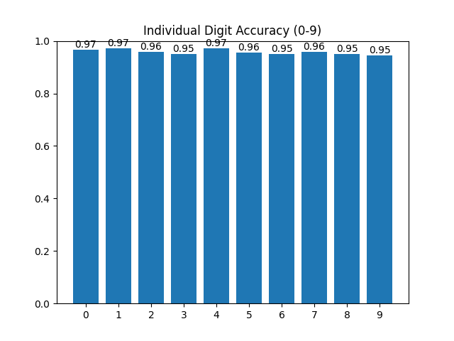

# CAPTCHA Recognition System

[](https://colab.research.google.com/github/mrro3t/CAPTCHA-Recognition-System/blob/main/train_on_Colab.ipynb)


A deep learning-based CAPTCHA Recognition system built with convolutional neural networks (CNN).  It automatically detects into readable text with high accuracy.

## 📚 Table of Contents

- [Overview](#overview)
- [Installation](#installation)
- [Image Pre-processing](#image-pre-processing)
- [Model Training](#model-training)
- [Evaluation](#evaluation)
- [Prediction](#prediction)
- [Results](#results)

## Overview

This deep learning system aims to detect CAPTCHA images using a custom-trained neural network model.  
It includes preprocessing, training, prediction, and evaluation modules — designed to be simple and modular.

## Installation

Clone the repository:

```bash
git clone https://github.com/mrro3t/CAPTCHA-Recognition-System.git
```

Set up virtual environment in the same folder. Instructions with venv below (use Windows Terminal):

```bash
python -m venv captcha
captcha\Scripts\activate
```

Install all Dependencies:
```bash
pip install -r requirements.txt
```

## Image Pre-processing

Before training, validation, or testing, each image undergoes a simple preprocessing pipeline to enhance character clarity. This includes median blurring to reduce noise, binary thresholding to separate foreground from background and reduce channels, and an additional median blur to reduce noise again and improve character definition.

<p align="center">
  
</p>

## Model Training (Google Colab Setup)

Training is optimized for Google Colab using the free-tier GPU. Since the dataset is binary images and lightweight, you can train for higher epochs without hitting resource limits.

Step 2 cell: Dataset Setup. Upload dataset from the `data/dataset.zip` to your Google Drive and update the file path accordingly in the notebook.

Step 9 cell: Adjusting Hyperparameters. To tweak learning rate, batch size, or number of epochs, modify the relevant variables in Step 9 of the notebook.

Model Output: Once training is complete, the trained model will be automatically saved to your Google Drive.

[](https://colab.research.google.com/github/mrro3t/CAPTCHA-Recognition-System/blob/main/train_on_Colab.ipynb)

## Evaluation (Locally)

This script evaluates the CAPTCHA model using validation images and computes performance metrics at both full CAPTCHA level and per-digit level. The best model is already saved in `models/`.

`metrics/captcha_metrics.png` – Overall accuracy, precision, recall, and F1-score.

`metrics/per_digit_accuracy.png` – Accuracy for each digit position in the 6-digit CAPTCHA.

`metrics/individual_digit_accuracy.png` – Accuracy for each digit (0–9) across all positions.

The below command requires no arguments, it runs on `data/validation-images` and `data/captcha_data.csv`. Metrics are stored in `metrics/`.

```bash
python eval.py
```

**Overall CAPTCHA Metrics**  


**Per-Digit Accuracy**  


**Individual Digit Accuracy (0-9)**  


## Prediction (Locally)

This script predicts the CAPTCHA model using validation images at default. Prediction is directly displayed on Terminal, and `output/predictions.csv` file is generated in `output/` with image path and predictions for easy visualization. It can be run on both GPU or CPU. Works on limited resource as well. The best model is already saved in `models/captcha_model_best.pth`.

Default :
```bash
python predict.py
```

Use Arguments to predict on custom model and test images.
### Command-Line Arguments
| Argument           | Description                        | Default Value                   |
|--------------------|------------------------------------|---------------------------------|
| `--model-name`     | Path to the custom model file      | `models/captcha_model_best.pth` |
| `--subfolder-name` | Path to a the test image directory | `data/validation-images`        |
| `--output-csv-name`| Name of the .csv file              | `predictions.csv`               |

Custom :
```bash
python predict.py --model-name "my_model.pth" --subfolder-name "test-images" --output-csv-name "results.csv"
```

## Results

Model : `models/captcha_model_best.pth`

### Metrics
| Metric              | Value   |
|---------------------|---------|
| Accuracy            | 81.60%  |
| Precision           | 81.67%  |
| Recall              | 81.60%  |
| F1 Score            | 81.62%  |

### Per-Digit Accuracy
| Digit Position      | Value   |
|---------------------|---------|
| Digit 1             | 97.85%  |
| Digit 2             | 96.45%  |
| Digit 3             | 95.35%  |
| Digit 4             | 94.55%  |
| Digit 5             | 93.80%  |
| Digit 6             | 96.80%  |

### Individual Digit Accuracy
| Digit               | Value   |
|---------------------|---------|
| 0                   | 96.78%  |
| 1                   | 97.13%  |
| 2                   | 95.94%  |
| 3                   | 94.95%  |
| 4                   | 97.31%  |
| 5                   | 95.61%  |
| 6                   | 94.92%  |
| 7                   | 95.88%  |
| 8                   | 95.03%  |
| 9                   | 94.60%  |